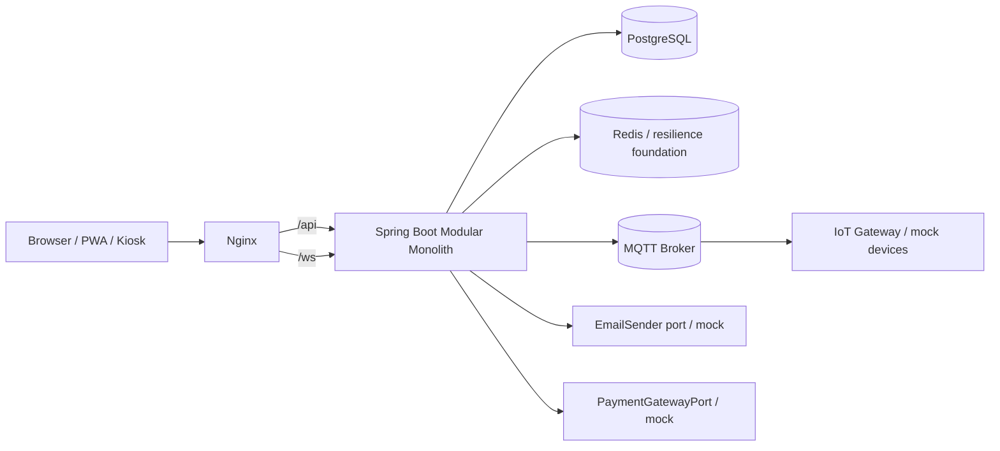

# System Architecture

Source requirements:

- [SRS](md/SRS_NEXUS_WEB_FULLSTACK.md)
- [Detailed Scope](md/NEXUS_Project_Scope_Chi_Tiet.md)

## Runtime View

## Backend Modules

| Module | Main responsibility | Status |
|---|---|---|
| common | BaseEntity, API response, exceptions, auditing, OpenAPI, scheduling, security foundation | DONE |
| auth | User, role, permission, JWT, refresh token, password reset, admin user operations | DONE |
| branch | Branch, zone, station, station credential, heartbeat | DONE |
| game/gamer | Game catalog, ranks, roles, gamer profile, station preference | DONE |
| session | QR login, play session, billing policy | DONE |
| wallet/payment | Wallet, wallet transaction, mock top-up/payment webhook | DONE with mock payment |
| ordering | Menu, stock MVP, order workflow, staff queue | DONE |
| social/lfg/lobby | Block/report, LFG, invitation, lobby, chat | DONE |
| iot | Device, telemetry, alert, command, MQTT abstraction/mock | DONE with mock MQTT |
| notification | In-app, WebSocket, push subscription foundation, delivery retry | DONE with mock push/email |
| report/jobs/audit | KPI queries, exports, scheduled cleanup/expiry, append-only audit | DONE |

## Frontend Architecture

React/Vite uses React Router, TanStack Query, Axios, Zustand auth store, React Hook Form, Zod validation, WebSocket abstraction, PWA service worker, and role-specific layouts:

- Gamer: profile, game profile, station preference, QR scanner, session, wallet, order, LFG/lobby.
- Station: kiosk credential, QR auto-refresh, heartbeat, session events.
- Staff F&B: order queue and state transitions.
- Staff Technical: device list and alert queue.
- Admin: branch/station/game/menu/user/device/wallet/audit/reporting screens.

## Integration Reality

| Integration | Current adapter | Production note |
|---|---|---|
| Payment gateway | Mock adapter | Real provider not selected |
| MQTT | Mock/dev adapter plus local Mosquitto compose service | Production requires TLS and gateway credentials |
| Browser push | Foundation/mock | Requires VAPID/provider setup |
| Email | EmailSender port/mock | Requires SMTP/provider configuration |
| Voice chat | VoiceProviderPort mock | Real provider not selected; no custom codec |
| Redis | In-memory resilience implementations in code; Redis service is prepared in Docker | Replace with Redis-backed adapters before multi-instance production |

## Key Constraints

- REST controllers return DTOs, not JPA entities.
- Business logic stays in services.
- Flyway manages schema; production uses `ddl-auto=validate`.
- Append-only tables include wallet transactions, audit logs, alert history, and command history.
- Branch scope and RBAC are enforced server-side.
