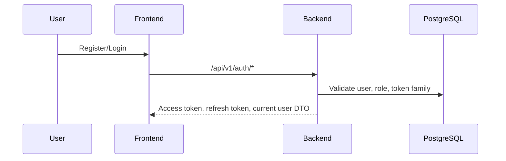
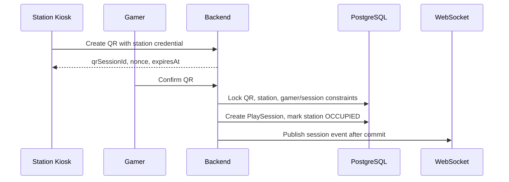
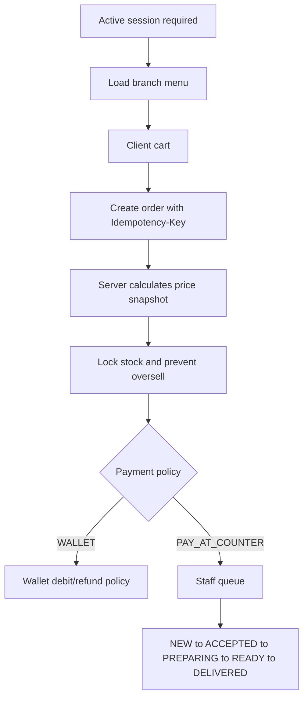

# System Flow

Source requirements:

- [SRS](md/SRS_NEXUS_WEB_FULLSTACK.md)
- [Detailed Scope](md/NEXUS_Project_Scope_Chi_Tiet.md)

## Auth

Refresh token rotation revokes the used token and detects reuse through token family rules. Locked or inactive users cannot authenticate.

## QR Login and Session

QR TTL is at most 60 seconds and QR is single-use. Backend remains the source of validation.

## Order

Client prices are display-only. Backend snapshots `itemName`, `unitPrice`, `quantity`, and `subtotal`.

## LFG, Invitation, Lobby, Chat

LFG requires an active session and valid game profile. Matching filters branch, game, rank, role, zone, and user block rules. Invitations expire after 60 seconds and accept is concurrency-safe. Lobby visibility and chat are limited to members.

## IoT and Smart Station

Preference application creates device commands with command/correlation IDs. ACK handling is idempotent; timeout and retry are limited. Critical alerts can block unsafe mechanical commands but normal IoT failure must not block a play session.

## Notification

Domain events produce in-app notifications and WebSocket messages. Browser push and email are foundations with mock/dev adapters until real providers are configured.

## Reporting

Dashboard/report APIs use aggregate queries/projections and include filter timezone, from/to, and generatedAt. CSV export follows the same filters and branch scope.
