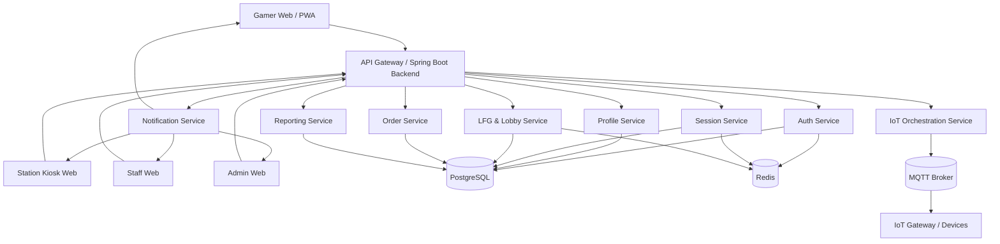
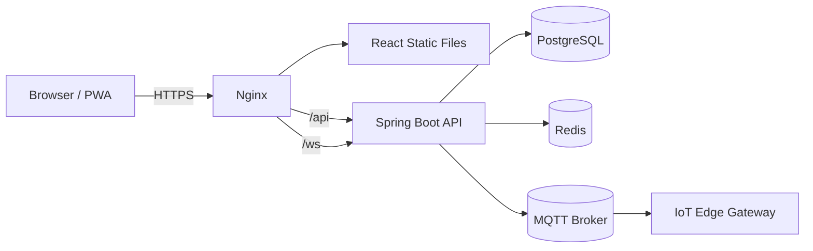
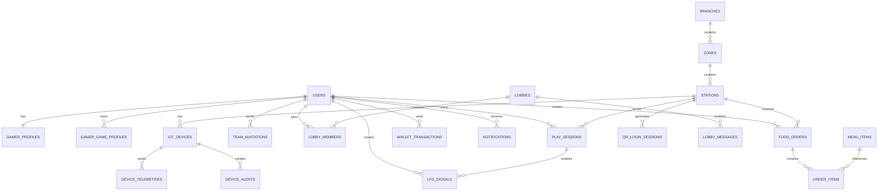

# SOFTWARE REQUIREMENTS SPECIFICATION (SRS)

# NEXUS SMART CYBER ESPORTS – WEB PLATFORM

| Thuộc tính | Nội dung |
|---|---|
| Mã tài liệu | SRS-NEXUS-WEB-01 |
| Phiên bản | 3.1 |
| Loại hệ thống | Web Application / Progressive Web App |
| Người thực hiện | Lê Duy Minh |
| Ngày cập nhật | 17/07/2026 |
| Backend | Java 17, Spring Boot 3 |
| Client | ReactJS, TypeScript, Vite |
| Cơ sở dữ liệu | PostgreSQL |
| Phạm vi | Gamer Web/PWA, Station Kiosk Web, Staff Web, Admin Web, IoT |

---

## 1. Giới thiệu

### 1.1. Mục đích

Tài liệu này mô tả các yêu cầu chức năng, yêu cầu phi chức năng, kiến trúc, công nghệ và tiêu chí nghiệm thu của hệ thống **NEXUS Smart Cyber Esports phiên bản Web**.

Hệ thống được xây dựng nhằm số hóa hoạt động của phòng máy Cyber Esports, bao gồm:

- Quản lý tài khoản Gamer.
- Đăng nhập máy trạm bằng mã QR.
- Quản lý phiên chơi.
- Cá nhân hóa Smart Station.
- Tìm đồng đội tại phòng máy.
- Tạo lời mời và Lobby.
- Đặt đồ ăn, nước uống.
- Xử lý đơn hàng cho nhân viên.
- Theo dõi thiết bị IoT.
- Quản trị chi nhánh và báo cáo.

Phiên bản này không phát triển ứng dụng Mobile Native hoặc Desktop Native. Toàn bộ giao diện người dùng được triển khai dưới dạng Web Application.

### 1.2. Đối tượng sử dụng tài liệu

- Product Owner và Business Analyst.
- Backend Developer.
- Frontend Developer.
- QA/Tester.
- UI/UX Designer.
- IoT/Firmware Engineer.
- Staff và Admin phòng máy.
- Giảng viên hoặc hội đồng đánh giá dự án.

### 1.3. Thuật ngữ

| Thuật ngữ | Giải thích |
|---|---|
| Gamer | Người chơi sử dụng dịch vụ tại phòng Cyber |
| Station | Máy trạm chơi game |
| Station Kiosk Web | Giao diện web chạy toàn màn hình tại máy trạm |
| Gamer Web/PWA | Giao diện web responsive dành cho Gamer |
| PWA | Progressive Web App, web có thể cài lên màn hình chính |
| Smart Station | Hệ thống cá nhân hóa bàn, ghế, RGB và thiết bị |
| LFG | Looking For Group, tìm người chơi để lập đội |
| Lobby | Nhóm người chơi được tạo sau khi chấp nhận lời mời |
| IoT | Hệ thống thiết bị vật lý kết nối mạng |
| Telemetry | Dữ liệu trạng thái được thiết bị gửi về |
| WebSocket | Kết nối hai chiều dùng cho dữ liệu thời gian thực |
| MQTT | Giao thức truyền thông giữa Backend, Gateway và thiết bị IoT |
| JWT | Token xác thực người dùng |
| RBAC | Phân quyền theo vai trò |

---

## 2. Bối cảnh và mục tiêu

### 2.1. Bối cảnh

Các phòng máy Cyber truyền thống chủ yếu quản lý thời gian chơi, máy trạm và đồ ăn bằng phần mềm tính tiền riêng lẻ. Người chơi vẫn phải thực hiện nhiều thao tác thủ công như đăng nhập tài khoản, gọi nhân viên, tìm đồng đội hoặc điều chỉnh thiết bị.

NEXUS Smart Cyber Esports xây dựng một nền tảng Web tích hợp nhằm đồng bộ trải nghiệm số và trải nghiệm vật lý tại phòng máy.

### 2.2. Mục tiêu

| Mục tiêu | Chỉ số mong muốn |
|---|---|
| Đăng nhập nhanh | Từ lúc xác nhận QR đến lúc tạo phiên không quá 5 giây |
| Cá nhân hóa máy trạm | Ít nhất 95% lệnh Smart Station hoàn tất trong 10 giây |
| Đặt món thuận tiện | Đơn mới xuất hiện trên Staff Web trong 3 giây |
| Hỗ trợ cộng đồng | Tìm người chơi và gửi lời mời trong tối đa 30 giây |
| Hỗ trợ vận hành | Cảnh báo thiết bị xuất hiện trong tối đa 10 giây |
| Truy cập đa thiết bị | Hoạt động trên máy tính, tablet và điện thoại |
| Quản trị tập trung | Admin theo dõi máy trạm, doanh thu và thiết bị trên Web |

---

## 3. Phạm vi hệ thống

### 3.1. Phạm vi trong dự án

- Đăng ký, đăng nhập và đăng xuất.
- Xác thực bằng JWT và Refresh Token.
- Quét QR bằng camera trình duyệt.
- Đăng nhập Station Kiosk Web bằng QR.
- Quản lý Gamer Profile.
- Quản lý cấu hình Smart Station.
- Quản lý phiên chơi.
- Tìm người chơi theo game, rank và vai trò.
- Gửi và xử lý lời mời.
- Tạo Lobby và chat thời gian thực.
- Đặt món ăn, đồ uống.
- Nhân viên tiếp nhận và xử lý đơn.
- Quản lý chi nhánh, khu vực, máy trạm và thiết bị.
- Nhận dữ liệu IoT qua MQTT.
- Hiển thị cảnh báo thiết bị.
- Dashboard và báo cáo.
- Audit Log.
- Notification thời gian thực.

### 3.2. Ngoài phạm vi

- Ứng dụng Android Native.
- Ứng dụng iOS Native.
- Desktop Application bằng JavaFX, Electron hoặc .NET.
- Hệ thống giải đấu quy mô lớn.
- Livestream.
- Marketplace vật phẩm game.
- Tự phát triển Voice Codec.
- Tự động sửa chữa thiết bị vật lý.
- Hệ thống kế toán doanh nghiệp hoàn chỉnh.

---

## 4. Nền tảng Web và các loại Client

Hệ thống sử dụng một nền tảng Frontend chung nhưng được chia thành ba giao diện nghiệp vụ.

### 4.1. Gamer Web/PWA

Dùng trên điện thoại, tablet hoặc máy tính cá nhân.

Chức năng:

- Đăng ký và đăng nhập.
- Quét QR tại máy trạm.
- Xem và cập nhật hồ sơ.
- Thiết lập cấu hình Smart Station.
- Xem số dư và lịch sử giao dịch.
- Xem phiên chơi hiện tại.
- Tìm đồng đội.
- Nhận lời mời.
- Quản lý Lobby.
- Đặt đồ ăn, nước uống.
- Theo dõi trạng thái đơn.
- Nhận Web Push Notification.

### 4.2. Station Kiosk Web

Chạy trên trình duyệt tại máy trạm Cyber, sử dụng chế độ toàn màn hình.

Chức năng:

- Hiển thị QR đăng nhập.
- Tự làm mới QR khi hết hạn.
- Hiển thị trạng thái mạng và máy trạm.
- Hiển thị thông tin phiên chơi.
- Hiển thị trạng thái Smart Station.
- Hiển thị Radar tìm đội.
- Hiển thị Quick Order Panel.
- Hiển thị lời mời và thông báo.
- Tự đăng xuất khi phiên kết thúc.

> Lưu ý: Web không thể tạo Overlay nổi ổn định trên tất cả trò chơi như ứng dụng Desktop Native. Vì vậy, chức năng PiP Overlay được thay thế bằng **Quick Order Panel** trong Station Kiosk Web hoặc Gamer PWA.

### 4.3. Staff/Admin Web

Dùng cho nhân viên và quản trị viên.

Chức năng Staff F&B:

- Xem hàng đợi đơn mới.
- Nhận đơn.
- Chuyển trạng thái đơn.
- Hủy đơn có lý do.
- Xác nhận giao đơn.

Chức năng Staff kỹ thuật:

- Xem cảnh báo thiết bị.
- Xác nhận đang xử lý.
- Ghi chú kết quả.
- Chuyển thiết bị sang bảo trì.

Chức năng Admin:

- Quản lý chi nhánh.
- Quản lý khu vực.
- Quản lý máy trạm.
- Quản lý thiết bị.
- Quản lý menu.
- Quản lý tài khoản nhân viên.
- Xem dashboard và báo cáo.
- Xem Audit Log.

---

## 5. Công nghệ sử dụng

## 5.1. Công nghệ phía Client

| Công nghệ | Mục đích |
|---|---|
| ReactJS | Xây dựng giao diện theo component |
| TypeScript | Kiểm soát kiểu dữ liệu, giảm lỗi |
| Vite | Khởi tạo, chạy và build frontend |
| React Router | Điều hướng giữa các trang |
| Axios | Gọi REST API |
| TanStack Query | Quản lý server state, cache và refetch |
| Zustand hoặc Redux Toolkit | Quản lý client state |
| Tailwind CSS | Xây dựng giao diện nhanh, responsive |
| Ant Design | Component cho Admin Dashboard |
| React Hook Form | Quản lý biểu mẫu |
| Zod | Kiểm tra dữ liệu phía client |
| STOMP.js | Giao tiếp WebSocket với Spring Boot |
| SockJS | Fallback cho WebSocket |
| html5-qrcode | Quét QR bằng camera trình duyệt |
| vite-plugin-pwa | Tạo Progressive Web App |
| Recharts hoặc Chart.js | Vẽ biểu đồ Dashboard |
| Vitest | Unit Test frontend |
| React Testing Library | Kiểm thử component |
| Playwright | Kiểm thử End-to-End |

### 5.1.1. Cấu trúc Frontend đề xuất

```text
nexus-client/
├── public/
├── src/
│   ├── api/
│   │   ├── axiosClient.ts
│   │   ├── authApi.ts
│   │   ├── profileApi.ts
│   │   ├── sessionApi.ts
│   │   ├── lfgApi.ts
│   │   ├── orderApi.ts
│   │   └── adminApi.ts
│   ├── assets/
│   ├── components/
│   │   ├── common/
│   │   ├── gamer/
│   │   ├── station/
│   │   ├── staff/
│   │   └── admin/
│   ├── features/
│   │   ├── auth/
│   │   ├── profile/
│   │   ├── session/
│   │   ├── smart-station/
│   │   ├── matchmaking/
│   │   ├── lobby/
│   │   ├── ordering/
│   │   ├── devices/
│   │   └── reporting/
│   ├── hooks/
│   ├── layouts/
│   ├── pages/
│   │   ├── gamer/
│   │   ├── station/
│   │   ├── staff/
│   │   └── admin/
│   ├── router/
│   ├── stores/
│   ├── types/
│   ├── utils/
│   ├── App.tsx
│   └── main.tsx
├── .env
├── package.json
├── tsconfig.json
└── vite.config.ts
```

### 5.1.2. Các biến môi trường Frontend

```env
VITE_API_BASE_URL=http://localhost:8080/api/v1
VITE_WS_URL=http://localhost:8080/ws
VITE_APP_NAME=NEXUS Smart Cyber Esports
VITE_QR_EXPIRE_SECONDS=60
```

## 5.2. Công nghệ phía Backend

| Công nghệ | Mục đích |
|---|---|
| Java 17 | Ngôn ngữ backend |
| Spring Boot 3 | Framework chính |
| Spring Web | REST API |
| Spring Data JPA | Truy cập cơ sở dữ liệu |
| Spring Security | Xác thực và phân quyền |
| JWT | Access Token và Refresh Token |
| PostgreSQL | Cơ sở dữ liệu quan hệ |
| Redis | Cache, QR session, blacklist token |
| WebSocket/STOMP | Notification thời gian thực |
| MQTT | Giao tiếp với IoT Gateway |
| Flyway | Quản lý migration |
| Maven | Quản lý dependency và build |
| Docker Compose | Khởi chạy môi trường |
| JUnit 5 | Unit Test |
| Mockito | Mock dependency |
| Testcontainers | Integration Test |
| OpenAPI/Swagger | Tài liệu API |
| Lombok | Giảm code lặp |
| MapStruct | Mapping Entity và DTO |

## 5.3. Cơ sở hạ tầng

- Nginx phục vụ frontend và reverse proxy.
- Docker cho Backend, PostgreSQL, Redis và MQTT Broker.
- Mosquitto hoặc EMQX làm MQTT Broker.
- GitHub Actions cho CI/CD.
- Prometheus và Grafana cho monitoring.
- ELK hoặc Loki cho centralized logging.

---

## 6. Tác nhân và phân quyền

| Tác nhân | Mô tả | Quyền chính |
|---|---|---|
| Gamer | Khách hàng sử dụng dịch vụ | Profile, QR Login, Session, LFG, Lobby, Order |
| Staff F&B | Nhân viên quầy | Xử lý đơn hàng |
| Staff kỹ thuật | Nhân viên thiết bị | Xử lý cảnh báo và bảo trì |
| Branch Admin | Quản trị chi nhánh | Quản lý trạm, thiết bị, menu và báo cáo |
| Super Admin | Quản trị toàn hệ thống | Quản lý đa chi nhánh và phân quyền |
| Station Kiosk | Trình duyệt tại máy trạm | Tạo QR, nhận Session Token |
| IoT Gateway | Cổng thiết bị tại chi nhánh | Nhận lệnh và gửi telemetry |
| Payment Gateway | Hệ thống thanh toán | Xử lý nạp tiền và thanh toán |
| Notification Service | Dịch vụ thông báo | Web Push, Email hoặc SMS |

### 6.1. Ma trận quyền

| Chức năng | Gamer | Staff F&B | Staff KT | Admin | Super Admin |
|---|---:|---:|---:|---:|---:|
| Quản lý hồ sơ cá nhân | Có | Không | Không | Xem | Xem |
| Quét QR đăng nhập trạm | Có | Không | Không | Có | Có |
| Quản lý Smart Station | Cấu hình cá nhân | Không | Xử lý lỗi | Cấu hình | Cấu hình |
| Tìm đội và Lobby | Có | Không | Không | Kiểm duyệt | Kiểm duyệt |
| Tạo đơn hàng | Có | Không | Không | Xem | Xem |
| Xử lý đơn | Không | Có | Không | Xem | Xem |
| Quản lý thiết bị | Xem thiết bị trạm | Không | Vận hành | Có | Có |
| Báo cáo | Lịch sử cá nhân | Hàng đợi đơn | Hàng đợi cảnh báo | Chi nhánh | Toàn hệ thống |

---

## 7. Kiến trúc tổng thể

### 7.1. Kiến trúc Client–Server



### 7.2. Kiến trúc triển khai



---

## 8. Yêu cầu chức năng

## 8.1. Xác thực và tài khoản

### FR-AUTH-01 – Đăng ký Gamer

Gamer nhập:

- Họ tên.
- Email hoặc số điện thoại.
- Mật khẩu.
- Xác nhận mật khẩu.

Hệ thống phải:

- Kiểm tra email hoặc số điện thoại không trùng.
- Kiểm tra định dạng dữ liệu.
- Mã hóa mật khẩu.
- Tạo tài khoản với vai trò `GAMER`.
- Trả về thông báo đăng ký thành công.

### FR-AUTH-02 – Đăng nhập

Hệ thống cho phép đăng nhập bằng:

- Email và mật khẩu.
- Số điện thoại và mật khẩu.

Kết quả thành công:

- Access Token.
- Refresh Token.
- Thông tin người dùng.
- Danh sách quyền.

### FR-AUTH-03 – Làm mới Access Token

- Client gửi Refresh Token.
- Backend kiểm tra tính hợp lệ.
- Backend thực hiện Refresh Token Rotation.
- Refresh Token cũ bị vô hiệu hóa.
- Backend trả Access Token và Refresh Token mới.

### FR-AUTH-04 – Đăng xuất

- Thu hồi Refresh Token.
- Đưa Access Token hiện tại vào blacklist nếu cần.
- Xóa thông tin xác thực phía client.
- Ngắt WebSocket của phiên đăng nhập.

### FR-AUTH-05 – Quên mật khẩu

- Gamer nhập email hoặc số điện thoại.
- Hệ thống tạo OTP hoặc reset token.
- Token có thời hạn.
- Người dùng đặt mật khẩu mới.

---

## 8.2. QR Login tại máy trạm

### FR-QR-01 – Station tạo QR

Station Kiosk Web gửi yêu cầu tạo QR.

QR chứa dữ liệu tham chiếu đến:

- QR session ID.
- Station ID.
- Nonce.
- Thời gian hết hạn.

QR không được chứa Access Token hoặc dữ liệu nhạy cảm.

### FR-QR-02 – Gamer quét QR

- Gamer mở Gamer Web/PWA.
- Cho phép trình duyệt truy cập camera.
- Quét mã bằng `html5-qrcode`.
- Hiển thị thông tin Station.
- Gamer xác nhận đăng nhập.

### FR-QR-03 – Xác nhận QR

Backend kiểm tra:

- QR còn hạn.
- QR chưa được sử dụng.
- Station đang sẵn sàng.
- Gamer chưa có Session Active.
- Tài khoản Gamer đang hoạt động.
- Số dư đáp ứng chính sách tối thiểu.

### FR-QR-04 – Tạo phiên chơi

Khi xác nhận hợp lệ:

- Tạo đúng một `PLAY_SESSION`.
- Gắn Gamer với Station.
- Đánh dấu QR đã sử dụng.
- Gửi sự kiện cho Station Kiosk qua WebSocket.
- Station chuyển sang giao diện phiên chơi.

---

## 8.3. Gamer Profile

### FR-PRO-01 – Xem hồ sơ

Hiển thị:

- Họ tên.
- Tên hiển thị.
- Avatar.
- Email.
- Số điện thoại.
- Số dư.
- Trạng thái tài khoản.
- Lịch sử phiên chơi.

### FR-PRO-02 – Cập nhật hồ sơ

Gamer có thể cập nhật:

- Tên hiển thị.
- Avatar.
- Chiều cao.
- Cân nặng.
- Night Mode.
- Cấu hình Smart Station.

### FR-PRO-03 – Quản lý Game Profile

Mỗi Game Profile gồm:

- Game.
- In-game name.
- Rank.
- Vai trò.
- Máy chủ hoặc khu vực.
- Trạng thái công khai.

---

## 8.4. Quản lý phiên chơi

### FR-SES-01 – Xem phiên hiện tại

Hiển thị:

- Station.
- Chi nhánh.
- Thời gian bắt đầu.
- Thời lượng đã chơi.
- Số dư hiện tại.
- Chi phí tạm tính.
- Trạng thái phiên.

### FR-SES-02 – Kết thúc phiên

Phiên được kết thúc khi:

- Gamer chọn kết thúc.
- Staff/Admin kết thúc.
- Station bị tắt.
- Tài khoản hết số dư theo chính sách.
- Có sự cố bắt buộc dừng.

### FR-SES-03 – Chống phiên trùng

- Mỗi Gamer chỉ có một Session Active.
- Mỗi Station chỉ có một Session Active.
- Request tạo phiên phải hỗ trợ idempotency.

---

## 8.5. Smart Station

### FR-IOT-01 – Cấu hình cá nhân

Gamer thiết lập:

- Chiều cao bàn.
- Góc ghế.
- Màu RGB.
- Mouse DPI.
- Độ sáng.
- Night Mode.

### FR-IOT-02 – Áp dụng cấu hình

Khi phiên bắt đầu:

1. Backend tải cấu hình.
2. Kiểm tra giới hạn an toàn.
3. Gửi lệnh MQTT.
4. IoT Gateway chuyển lệnh đến thiết bị.
5. Thiết bị trả ACK.
6. Backend cập nhật tiến độ qua WebSocket.

### FR-IOT-03 – Xử lý lỗi

- Thiết bị lỗi không được chặn Gamer sử dụng PC.
- Retry tối đa 2 lần.
- Nếu vẫn lỗi, tạo Device Alert.
- Lệnh cơ khí nguy hiểm phải bị dừng.
- Cho phép sử dụng cấu hình mặc định.

---

## 8.6. Local Matchmaking

### FR-LFG-01 – Tạo tín hiệu tìm đội

Gamer nhập:

- Game.
- Rank.
- Vai trò.
- Số thành viên cần tìm.
- Lời nhắn.

### FR-LFG-02 – Tìm ứng viên

Hệ thống ưu tiên:

1. Cùng chi nhánh.
2. Đang có Session Active.
3. Cùng game.
4. Rank phù hợp.
5. Vai trò bổ sung.
6. Không nằm trong danh sách chặn.

### FR-LFG-03 – Hủy và hết hạn

- Gamer có thể hủy tín hiệu.
- Tín hiệu hết hạn sau 15 phút.
- Tín hiệu tự đóng khi Session kết thúc.

---

## 8.7. Invitation và Lobby

### FR-LOB-01 – Gửi lời mời

- Gamer gửi lời mời từ Radar.
- Người nhận nhận notification thời gian thực.
- Lời mời hết hạn sau 60 giây.

### FR-LOB-02 – Phản hồi lời mời

Người nhận có thể:

- Đồng ý.
- Từ chối.
- Bỏ qua.

### FR-LOB-03 – Tạo Lobby

Khi lời mời được chấp nhận:

- Tạo Lobby.
- Thêm người gửi và người nhận.
- Tạo kênh chat.
- Gửi trạng thái Lobby cho các Client.

### FR-LOB-04 – Chat

- Gửi tin nhắn thời gian thực.
- Lưu lịch sử trong thời gian giới hạn.
- Cho phép rời Lobby.
- Cho phép chủ Lobby xóa thành viên.
- Hỗ trợ report và block.

---

## 8.8. Đặt đồ ăn và nước uống

### FR-ORD-01 – Xem menu

Hiển thị:

- Hình ảnh.
- Tên món.
- Danh mục.
- Giá.
- Trạng thái còn hàng.
- Thời gian chuẩn bị dự kiến.

### FR-ORD-02 – Giỏ hàng

Gamer có thể:

- Thêm món.
- Tăng hoặc giảm số lượng.
- Xóa món.
- Thêm ghi chú.
- Xem tổng tiền.

### FR-ORD-03 – Tạo đơn

Backend phải:

- Kiểm tra Session Active.
- Kiểm tra tồn kho.
- Snapshot giá.
- Tính tổng tiền.
- Gắn đơn với Station.
- Tạo mã đơn.
- Gửi notification tới Staff Web.

### FR-ORD-04 – Theo dõi trạng thái

Trạng thái đơn:

```text
NEW
ACCEPTED
PREPARING
READY
DELIVERED
CANCELLED
```

Gamer nhận cập nhật qua WebSocket.

---

## 8.9. Staff xử lý đơn

### FR-STAFF-01 – Hàng đợi đơn

- Hiển thị đơn mới theo thời gian.
- Sắp xếp theo SLA.
- Có âm báo hoặc Browser Notification.
- Cho phép lọc theo trạng thái.

### FR-STAFF-02 – Cập nhật trạng thái

Chuỗi hợp lệ:

```text
NEW → ACCEPTED → PREPARING → READY → DELIVERED
```

Không được bỏ qua trạng thái nếu chính sách không cho phép.

### FR-STAFF-03 – Hủy đơn

- Chọn lý do hủy.
- Ghi Audit Log.
- Hoàn tiền nếu đã trừ số dư.
- Thông báo cho Gamer.

---

## 8.10. Thiết bị và cảnh báo

### FR-DEV-01 – Quản lý thiết bị

Admin có thể:

- Thêm thiết bị.
- Cập nhật thiết bị.
- Gán thiết bị vào Station.
- Chuyển trạng thái.
- Xem lịch sử.

### FR-DEV-02 – Telemetry

Thiết bị gửi:

- Heartbeat.
- Trạng thái online.
- Giá trị cảm biến.
- Mã lỗi.
- Firmware version.
- Thời điểm cập nhật.

### FR-DEV-03 – Device Alert

Tạo cảnh báo khi:

- Mất heartbeat.
- Sai lệch cảm biến.
- Phản hồi bất thường.
- Lệnh quá thời gian.
- Thiết bị báo lỗi.

Mức độ:

```text
INFO
WARNING
ERROR
CRITICAL
```

---

## 8.11. Dashboard và báo cáo

### FR-RPT-01 – Dashboard

Admin xem:

- Số Station Active.
- Tỷ lệ sử dụng.
- Doanh thu giờ chơi.
- Doanh thu F&B.
- Doanh thu nạp tiền.
- Số đơn theo trạng thái.
- Số cảnh báo thiết bị.
- Tỷ lệ ghép đội thành công.

### FR-RPT-02 – Bộ lọc

- Theo ngày.
- Theo tuần.
- Theo tháng.
- Theo chi nhánh.
- Theo khu vực.
- Theo Station.

### FR-RPT-03 – Xuất dữ liệu

- CSV.
- XLSX.
- Không xuất dữ liệu vượt ngoài phạm vi quyền.

---

## 8.12. Notification

Các loại thông báo:

- QR Login thành công.
- Smart Station áp dụng thành công.
- Smart Station áp dụng một phần.
- Lời mời mới.
- Lời mời được chấp nhận.
- Đơn hàng mới.
- Đơn đã tiếp nhận.
- Đơn đang chuẩn bị.
- Đơn sẵn sàng.
- Đơn đã giao.
- Cảnh báo thiết bị.

Kênh thông báo:

- WebSocket.
- In-app notification.
- Browser Notification.
- Web Push.
- Email trong các trường hợp quan trọng.

---

## 8.13. Audit Log

Ghi lại:

- Người thực hiện.
- Thời gian.
- Địa chỉ IP.
- Hành động.
- Đối tượng.
- Dữ liệu trước thay đổi.
- Dữ liệu sau thay đổi.
- Correlation ID.

Các hành động bắt buộc ghi Audit:

- Thay đổi quyền.
- Cập nhật thiết bị.
- Hủy đơn.
- Hoàn tiền.
- Kết thúc phiên thủ công.
- Thay đổi menu.
- Thay đổi cấu hình hệ thống.

---

## 9. Quy tắc nghiệp vụ

| Mã | Quy tắc |
|---|---|
| BR-01 | QR có hiệu lực tối đa 60 giây |
| BR-02 | QR chỉ được sử dụng một lần |
| BR-03 | Một Gamer chỉ có một Session Active |
| BR-04 | Một Station chỉ có một Session Active |
| BR-05 | Desk Height từ 60 đến 120 cm |
| BR-06 | Chair Angle từ 90 đến 145 độ |
| BR-07 | RGB phải đúng định dạng `#RRGGBB` |
| BR-08 | Lỗi IoT không được chặn quyền chơi game |
| BR-09 | LFG chỉ hiển thị Gamer đang Active |
| BR-10 | LFG hết hạn sau 15 phút |
| BR-11 | Không hiển thị email, điện thoại và số dư trên Radar |
| BR-12 | Invitation hết hạn sau 60 giây |
| BR-13 | Giá đơn được lưu tại thời điểm đặt |
| BR-14 | Món Out Of Stock không được đặt |
| BR-15 | Trạng thái đơn phải tuân thủ state machine |
| BR-16 | Thiết bị mất 3 heartbeat được xem là Offline |
| BR-17 | Mọi thao tác quản trị quan trọng phải ghi Audit |
| BR-18 | Admin chỉ xem dữ liệu trong phạm vi được cấp |
| BR-19 | Access Token có thời hạn ngắn |
| BR-20 | Refresh Token phải được rotation |
| BR-21 | QR không chứa JWT hoặc dữ liệu nhạy cảm |
| BR-22 | Camera chỉ được dùng sau khi người dùng cấp quyền |

---

## 10. Mô hình dữ liệu

### 10.1. Danh sách bảng chính

| Bảng | Mục đích |
|---|---|
| users | Tài khoản |
| roles | Vai trò |
| user_roles | Quan hệ tài khoản và vai trò |
| gamer_profiles | Hồ sơ Gamer |
| gamer_game_profiles | Profile theo game |
| branches | Chi nhánh |
| zones | Khu vực |
| stations | Máy trạm |
| station_preferences | Cấu hình cá nhân |
| play_sessions | Phiên chơi |
| qr_login_sessions | Phiên QR |
| refresh_tokens | Refresh Token |
| token_blacklists | Token bị thu hồi |
| games | Danh mục game |
| lfg_signals | Tín hiệu tìm đội |
| team_invitations | Lời mời |
| lobbies | Lobby |
| lobby_members | Thành viên Lobby |
| lobby_messages | Tin nhắn |
| menu_categories | Danh mục món |
| menu_items | Món ăn |
| food_orders | Đơn hàng |
| order_items | Chi tiết đơn |
| wallet_transactions | Giao dịch số dư |
| iot_devices | Thiết bị |
| device_telemetries | Dữ liệu telemetry |
| device_alerts | Cảnh báo |
| notifications | Thông báo |
| audit_logs | Nhật ký quản trị |

### 10.2. ERD tổng quát



---

## 11. Thiết kế API

### 11.1. Authentication

| Method | Endpoint | Mục đích |
|---|---|---|
| POST | `/api/v1/auth/register` | Đăng ký |
| POST | `/api/v1/auth/login` | Đăng nhập |
| POST | `/api/v1/auth/refresh-token` | Làm mới token |
| POST | `/api/v1/auth/logout` | Đăng xuất |
| POST | `/api/v1/auth/forgot-password` | Quên mật khẩu |
| POST | `/api/v1/auth/reset-password` | Đặt lại mật khẩu |

### 11.2. QR và Session

| Method | Endpoint | Mục đích |
|---|---|---|
| POST | `/api/v1/qr-sessions` | Station tạo QR |
| GET | `/api/v1/qr-sessions/{id}` | Kiểm tra QR |
| POST | `/api/v1/qr-sessions/{id}/confirm` | Gamer xác nhận |
| GET | `/api/v1/sessions/current` | Xem phiên hiện tại |
| POST | `/api/v1/sessions/{id}/end` | Kết thúc phiên |

### 11.3. Profile và Smart Station

| Method | Endpoint | Mục đích |
|---|---|---|
| GET | `/api/v1/profiles/me` | Xem profile |
| PUT | `/api/v1/profiles/me` | Cập nhật profile |
| GET | `/api/v1/profiles/me/games` | Danh sách Game Profile |
| POST | `/api/v1/profiles/me/games` | Thêm Game Profile |
| PUT | `/api/v1/profiles/me/station-preference` | Cập nhật cấu hình |
| POST | `/api/v1/stations/{id}/apply-profile` | Áp dụng cấu hình |

### 11.4. LFG và Lobby

| Method | Endpoint | Mục đích |
|---|---|---|
| POST | `/api/v1/lfg/signals` | Tạo LFG |
| GET | `/api/v1/lfg/signals` | Tìm ứng viên |
| DELETE | `/api/v1/lfg/signals/{id}` | Hủy LFG |
| POST | `/api/v1/team-invitations` | Gửi lời mời |
| PATCH | `/api/v1/team-invitations/{id}` | Phản hồi |
| GET | `/api/v1/lobbies/{id}` | Xem Lobby |
| POST | `/api/v1/lobbies/{id}/messages` | Gửi tin nhắn |
| DELETE | `/api/v1/lobbies/{id}/members/me` | Rời Lobby |

### 11.5. Order

| Method | Endpoint | Mục đích |
|---|---|---|
| GET | `/api/v1/menu-items` | Xem menu |
| POST | `/api/v1/orders` | Tạo đơn |
| GET | `/api/v1/orders/my-orders` | Đơn của Gamer |
| GET | `/api/v1/staff/orders` | Hàng đợi Staff |
| PATCH | `/api/v1/staff/orders/{id}/status` | Cập nhật trạng thái |
| POST | `/api/v1/staff/orders/{id}/cancel` | Hủy đơn |

### 11.6. Admin và thiết bị

| Method | Endpoint | Mục đích |
|---|---|---|
| GET | `/api/v1/admin/branches` | Danh sách chi nhánh |
| POST | `/api/v1/admin/stations` | Tạo Station |
| GET | `/api/v1/admin/devices` | Danh sách thiết bị |
| POST | `/api/v1/admin/devices` | Thêm thiết bị |
| PATCH | `/api/v1/admin/devices/{id}` | Cập nhật thiết bị |
| GET | `/api/v1/admin/device-alerts` | Xem cảnh báo |
| PATCH | `/api/v1/admin/device-alerts/{id}` | Xử lý cảnh báo |
| GET | `/api/v1/admin/reports/overview` | Dashboard |
| GET | `/api/v1/admin/audit-logs` | Audit Log |

---

## 12. WebSocket

### 12.1. Endpoint

```text
/ws
```

### 12.2. Topic đề xuất

```text
/topic/stations/{stationId}
/topic/users/{userId}
/topic/branches/{branchId}/orders
/topic/branches/{branchId}/alerts
/topic/lobbies/{lobbyId}
/user/queue/notifications
```

### 12.3. Sự kiện

```json
{
  "type": "ORDER_STATUS_CHANGED",
  "timestamp": "2026-07-17T10:30:00Z",
  "correlationId": "d6f6c2e0-1234-4567-8888-123456789abc",
  "data": {
    "orderId": 1001,
    "status": "PREPARING"
  }
}
```

---

## 13. MQTT

### 13.1. Topic

```text
nexus/{branchId}/{stationId}/{deviceId}/command
nexus/{branchId}/{stationId}/{deviceId}/ack
nexus/{branchId}/{stationId}/{deviceId}/telemetry
nexus/{branchId}/{stationId}/{deviceId}/heartbeat
```

### 13.2. Command mẫu

```json
{
  "commandId": "cmd-10001",
  "type": "SET_DESK_HEIGHT",
  "value": 78,
  "unit": "cm",
  "timestamp": "2026-07-17T10:30:00Z"
}
```

---

## 14. Yêu cầu giao diện

## 14.1. Gamer Web/PWA

### Trang chính

- Thông tin phiên.
- Số dư.
- Trạng thái Station.
- Quick Action.
- Notification.

### Trang quét QR

- Khung camera.
- Nút bật/tắt camera.
- Chọn camera trước hoặc sau.
- Nhập mã thủ công khi camera lỗi.
- Thông báo quyền camera.

### Trang Radar

- Bộ lọc game.
- Bộ lọc rank.
- Bộ lọc vai trò.
- Card người chơi.
- Nút gửi lời mời.

### Trang đặt món

- Danh mục.
- Tìm kiếm.
- Card món ăn.
- Giỏ hàng.
- Thanh toán.
- Trạng thái đơn.

## 14.2. Station Kiosk Web

- Thiết kế toàn màn hình.
- QR lớn.
- Countdown.
- Tự refresh.
- Trạng thái mạng.
- Không hiển thị dữ liệu nhạy cảm khi chưa đăng nhập.
- Tự quay lại màn hình QR sau khi phiên kết thúc.

## 14.3. Staff Web

- Bảng đơn hàng.
- Kanban theo trạng thái.
- Âm báo đơn mới.
- Action button rõ ràng.
- Hiển thị Station giao hàng.

## 14.4. Admin Web

- Sidebar.
- Dashboard.
- Bảng dữ liệu.
- Biểu đồ.
- Bộ lọc.
- Phân trang.
- Export.
- Responsive tối thiểu cho tablet.

---

## 15. Yêu cầu phi chức năng

| Mã | Nhóm | Yêu cầu |
|---|---|---|
| NFR-PERF-01 | Hiệu năng | 95% API phản hồi dưới 500 ms |
| NFR-PERF-02 | QR | Xác nhận QR và tạo Session dưới 5 giây |
| NFR-PERF-03 | Realtime | Notification đến client dưới 3 giây |
| NFR-IOT-01 | IoT | Smart Station hoàn tất dưới 10 giây |
| NFR-AVL-01 | Sẵn sàng | Backend đạt 99.5% mỗi tháng |
| NFR-SCL-01 | Mở rộng | Hỗ trợ 20 chi nhánh và 2.000 Station |
| NFR-SEC-01 | Bảo mật | HTTPS, JWT, Refresh Token Rotation |
| NFR-SEC-02 | Dữ liệu | Không log token và mật khẩu |
| NFR-AUD-01 | Audit | Audit Log lưu tối thiểu 12 tháng |
| NFR-WEB-01 | Trình duyệt | Chrome, Edge, Firefox phiên bản hiện hành |
| NFR-WEB-02 | Responsive | Hỗ trợ màn hình từ 360 px |
| NFR-PWA-01 | PWA | Có manifest và service worker |
| NFR-UX-01 | UX | QR và Order có thể thao tác trong tối đa 3 bước |
| NFR-BCK-01 | Sao lưu | RPO ≤ 15 phút, RTO ≤ 4 giờ |
| NFR-OBS-01 | Quan sát | Có log, metrics, tracing và alert |

---

## 16. Bảo mật

- Chỉ giao tiếp qua HTTPS.
- Access Token có thời hạn ngắn.
- Refresh Token lưu bằng HttpOnly Secure Cookie hoặc cơ chế an toàn tương đương.
- Không lưu Refresh Token trong `localStorage`.
- Áp dụng CORS theo whitelist.
- Áp dụng CSRF protection khi dùng Cookie Authentication.
- Kiểm tra XSS.
- Validate dữ liệu ở cả client và backend.
- Áp dụng Content Security Policy.
- Rate limit đăng nhập và QR confirm.
- Mật khẩu mã hóa bằng BCrypt hoặc Argon2.
- MFA cho Admin.
- RBAC theo vai trò và chi nhánh.
- Không tin dữ liệu role gửi từ client.
- Kiểm tra IDOR.
- QR chỉ lưu mã tham chiếu ngẫu nhiên.
- Camera chỉ được khởi tạo sau khi người dùng cấp quyền.
- WebSocket phải xác thực.
- MQTT sử dụng TLS và tài khoản riêng cho Gateway.
- Webhook phải có chữ ký và chống replay.

---

## 17. Kiểm thử

### 17.1. Frontend

- Unit Test bằng Vitest.
- Component Test bằng React Testing Library.
- E2E Test bằng Playwright.
- Kiểm thử Responsive.
- Kiểm thử quyền camera.
- Kiểm thử mất mạng.
- Kiểm thử WebSocket reconnect.
- Kiểm thử PWA.

### 17.2. Backend

- Unit Test bằng JUnit 5.
- Mock bằng Mockito.
- Integration Test bằng Testcontainers.
- Test PostgreSQL.
- Test Redis.
- Test MQTT.
- Test WebSocket.
- Test Security.
- Test API bằng MockMvc.

### 17.3. Test luồng chính

```text
Đăng nhập → Quét QR → Tạo Session → Áp dụng Smart Station
```

```text
Tạo LFG → Tìm ứng viên → Gửi Invitation → Tạo Lobby
```

```text
Xem menu → Tạo đơn → Staff xử lý → Delivered
```

```text
Thiết bị mất heartbeat → Tạo Alert → Staff xác nhận → Maintenance
```

---

## 18. Tiêu chí nghiệm thu

| Mã | Tiêu chí |
|---|---|
| AC-01 | QR hợp lệ tạo đúng một Session Active |
| AC-02 | QR hết hạn hoặc đã dùng không thể dùng lại |
| AC-03 | Gamer không thể có hai Session Active |
| AC-04 | Smart Station hoàn tất trong 10 giây ở điều kiện bình thường |
| AC-05 | Lỗi IoT không chặn phiên chơi |
| AC-06 | Chỉ Gamer Active xuất hiện trên Radar |
| AC-07 | Invitation hết hạn không thể chấp nhận |
| AC-08 | Accept Invitation tạo Lobby |
| AC-09 | Món hết hàng không thể đặt |
| AC-10 | Giá Order Item không đổi khi giá Menu thay đổi |
| AC-11 | Staff không thể chuyển sai trạng thái đơn |
| AC-12 | Đơn mới xuất hiện trên Staff Web dưới 3 giây |
| AC-13 | Thiết bị mất 3 heartbeat tạo cảnh báo |
| AC-14 | Admin không truy cập dữ liệu ngoài chi nhánh |
| AC-15 | Website hoạt động trên Chrome và Edge |
| AC-16 | Giao diện Gamer sử dụng được từ màn hình 360 px |
| AC-17 | Camera QR hoạt động trên HTTPS hoặc localhost |
| AC-18 | Các thao tác quản trị quan trọng có Audit Log |

---

## 19. Rủi ro và phương án giảm thiểu

| Mã | Rủi ro | Mức độ | Giảm thiểu |
|---|---|---:|---|
| R-01 | Trình duyệt không được cấp quyền camera | Trung bình | Cho nhập mã QR thủ công |
| R-02 | Web không tạo overlay trên game ổn định | Cao | Dùng Gamer PWA hoặc Quick Order Panel |
| R-03 | WebSocket bị mất kết nối | Trung bình | Reconnect và fallback polling |
| R-04 | Thiết bị IoT nhiều giao thức | Cao | Dùng Edge Gateway và Adapter |
| R-05 | Lệnh cơ khí mất an toàn | Cao | Validate backend và hard limit firmware |
| R-06 | Mạng chi nhánh chập chờn | Cao | Retry, Redis, local fallback |
| R-07 | Tồn kho F&B sai | Trung bình | Reservation và Audit |
| R-08 | Lạm dụng Radar | Trung bình | Block, report và rate limit |
| R-09 | PWA cache phiên bản cũ | Trung bình | Version service worker và cache strategy |
| R-10 | Token bị đánh cắp | Cao | HttpOnly Cookie, rotation và revoke |

---

## 20. Cấu trúc Repository đề xuất

```text
NEXUS_CYBER/
├── nexus-backend/
│   ├── src/main/java/
│   ├── src/main/resources/
│   ├── src/test/java/
│   └── pom.xml
├── nexus-client/
│   ├── src/
│   ├── public/
│   ├── package.json
│   └── vite.config.ts
├── deployment/
│   ├── nginx/
│   ├── docker/
│   └── monitoring/
├── docs/
│   ├── SRS_NEXUS_WEB_FULLSTACK.md
│   ├── API.md
│   └── DATABASE.md
├── docker-compose.yml
└── README.md
```

---

## 21. Lệnh khởi tạo Client

```bash
npm create vite@latest nexus-client -- --template react-ts
cd nexus-client
npm install
```

Cài thư viện:

```bash
npm install react-router-dom axios
npm install @tanstack/react-query
npm install zustand
npm install react-hook-form zod @hookform/resolvers
npm install @stomp/stompjs sockjs-client
npm install html5-qrcode
npm install antd
npm install recharts
npm install -D tailwindcss postcss autoprefixer
npm install -D vite-plugin-pwa
npm install -D vitest @testing-library/react @testing-library/jest-dom
npm install -D @playwright/test
```

---

## 22. Kết luận

NEXUS Smart Cyber Esports được triển khai theo mô hình **Web Application đa giao diện**, gồm:

- Gamer Web/PWA.
- Station Kiosk Web.
- Staff Web.
- Admin Web.

Frontend sử dụng:

```text
ReactJS + TypeScript + Vite
Tailwind CSS / Ant Design
Axios + TanStack Query
WebSocket + STOMP
PWA
html5-qrcode
```

Backend sử dụng:

```text
Java 17
Spring Boot 3
Spring Security
JWT + Refresh Token
Spring Data JPA
PostgreSQL
Redis
WebSocket
MQTT
Flyway
Maven
Docker Compose
JUnit 5
Mockito
Testcontainers
```

Kiến trúc này phù hợp với mục tiêu xây dựng một hệ thống quản lý Cyber Esports hiện đại, có khả năng truy cập trên nhiều thiết bị mà không cần phát triển riêng ứng dụng Android, iOS hoặc Desktop Native.
